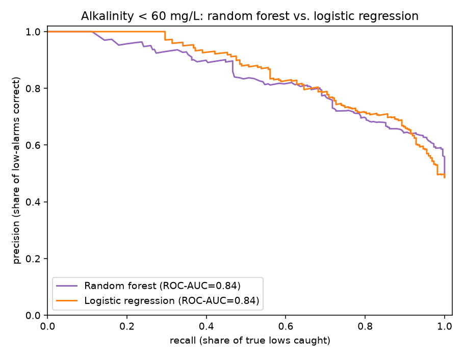
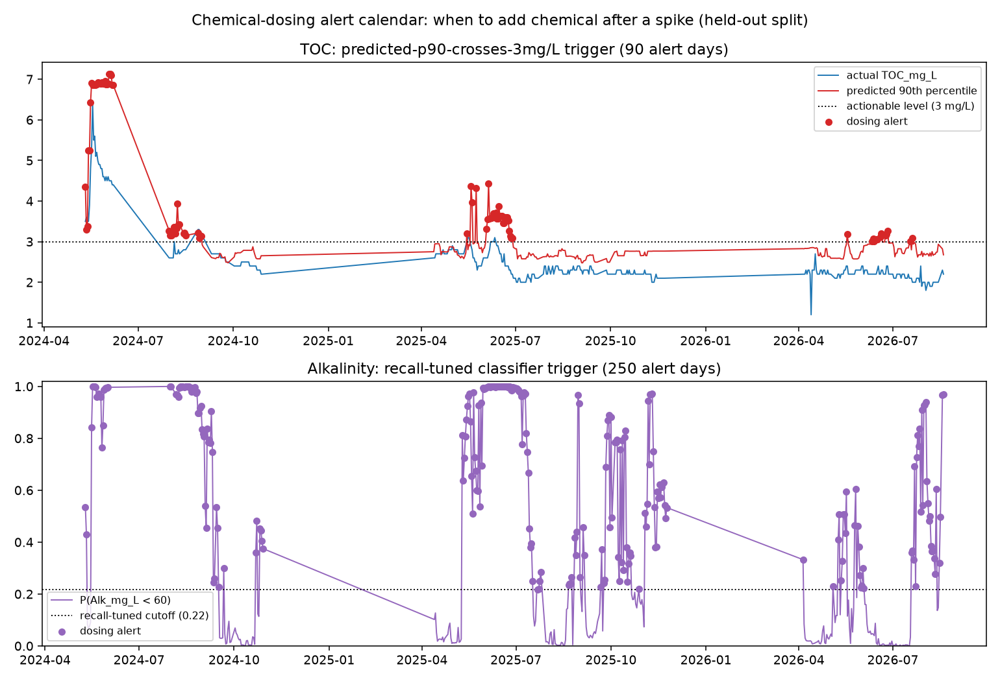
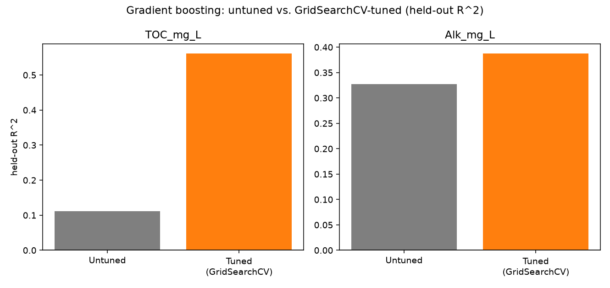
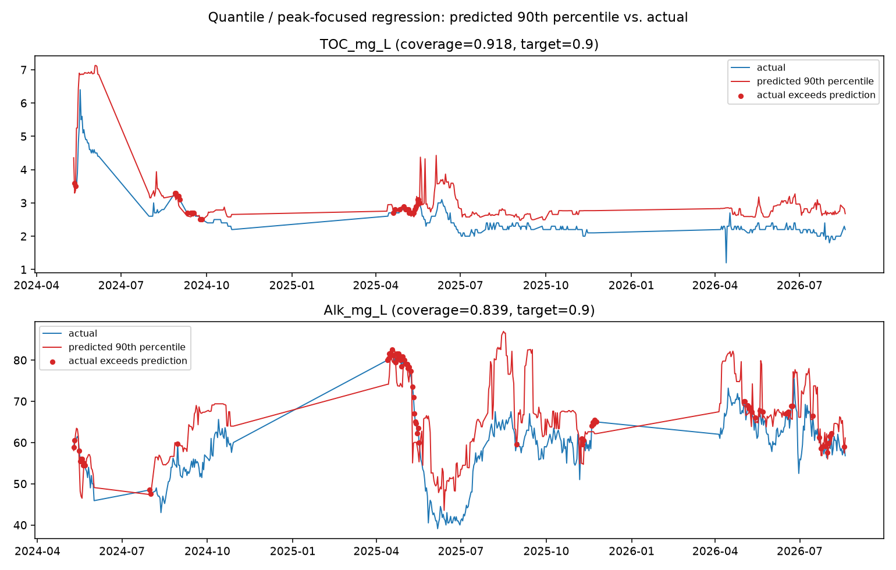
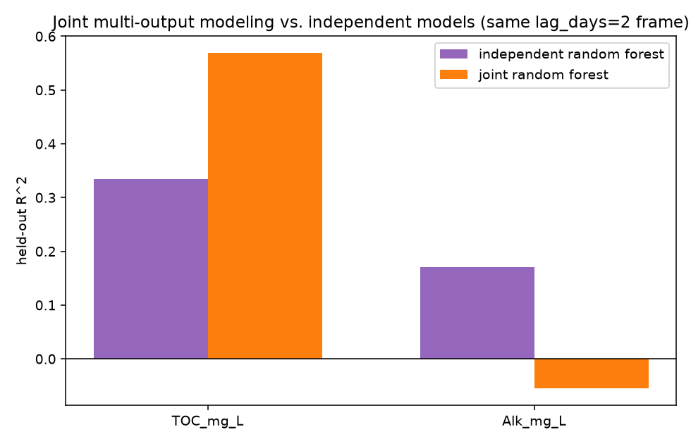
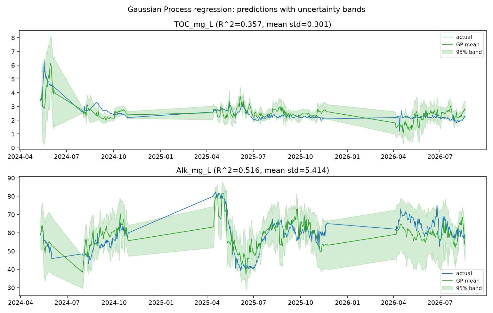
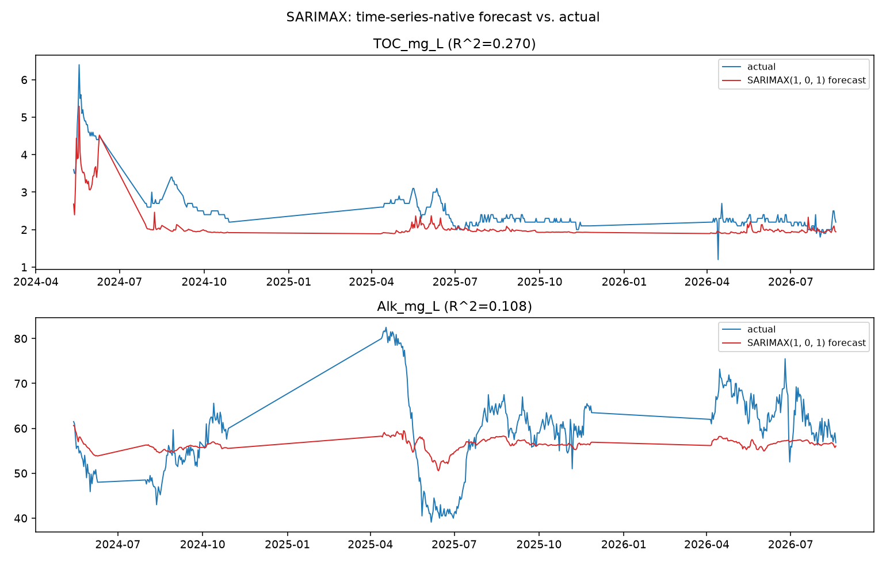

# Scenario 1: TOC and Alkalinity Predictive Model

Part of the [Design Storm 2026 challenge writeup](challenge_writeup.md) — see
that file for the shared intro, data terms, and reproduction steps. Quotes
below are transcribed directly from
[the deck](../../../reference/Explore%20DDD%202026%20Denver%20Water%20Design%20Storm%20Presentation.pdf)
(slide 9). Every number is computed by
[`analyze_parameters.py`](../analyze_parameters.py) and lives in
[`results/parameter_summary.md`](../results/parameter_summary.md) — see
[`parameters.md`](../parameters.md) for the full column-by-column catalog this
writeup draws on.

> Can watershed, hydrologic, and reservoir monitoring data provide enough
> advance warning to accurately predict TOC and alkalinity arriving at
> Foothills and give treatment staff actionable time to prepare?
>
> - Using national datasets upstream of Strontia Springs Reservoir; predict
>   TOC and Alkalinity concentrations a few days ahead hitting Foothills
>   treatment plant.
> - Introduce real-time Strontia profiling sonde data for improving
>   predictions. This location is much closer to the Foothills influent
>   which may influence accuracy but also impact lead/lag time.
> - Machine learning aficionados could try different models (like
>   support-vector machines), lag-times, and feature engineering to see if
>   they can improve performance.
> - Develop a web-application for viewing all the relevant data for
>   predictions (streamflow, weather, USGS sonde measured water quality),
>   and projected TOC and/or alkalinity.

## Available ML solutions (built here)

The first bullet is fully covered with the national datasets already in
`data/`: [`data_loader.py`](../data_loader.py) joins the USGS gage, DWR
telemetry, SNOTEL snowpack, and NOAA weather feeds onto the Foothills lab
results, shifted 2 days (TOC) / 4 days (alkalinity) as Jake's own models do.

> **Simplification vs. the originals:** Jake's own notebooks
> (`scripts/TOC_SoftSensor.ipynb`, `scripts/Alkalinity_Soft_Sensor.ipynb`,
> read-only) lag each upstream source *separately* rather than shifting
> everything by one number — NOAA precip gets 4 days for TOC / 6 for
> alkalinity (2 days more than the gage/SNOTEL/DWR sources), because NOAA's
> feed itself is already ≈2 days behind present day, so the extra lag
> compensates for that source's own reporting delay, not a longer physical
> transit time. `data_loader.build_dataset` here shifts every predictor
> column together by the same `lag_days`, so the lead-time numbers quoted
> below (2/4 days) describe the lab-result lag only, not precip's own extra
> reporting-delay margin.
>
> **Is Jake's per-source lag actually better?** Mixed, and worth reporting
> honestly rather than assuming yes: `data_loader.build_dataset_per_source_lag`
> reproduces his exact per-source shifts, refit with the same random forest
> and feature list as the model-family table below —

| target | lag approach | held-out R² |
|---|---|---:|
| TOC_mg_L | uniform (lag_days=2 for every source) | 0.334 |
| TOC_mg_L | per-source (Jake's: precip lagged 2 days further) | 0.599 |
| Alk_mg_L | uniform (lag_days=4 for every source) | 0.234 |
| Alk_mg_L | per-source (Jake's: precip lagged 2 days further) | 0.184 |

> TOC improves substantially (+0.265 R²) — precipitation's own reporting
> delay really was costing this catalog's uniform-lag TOC model accuracy.
> Alkalinity gets slightly *worse* (-0.050) — its features lean on
> `Specific_Cond_Mean`/`pH_Median`/flow rather than precipitation, so
> lagging precip 2 days further just moves that one feature further out of
> sync with the rest, with no offsetting benefit. Full numbers in
> [`results/parameter_summary.md`](../results/parameter_summary.md)'s
> "Per-source lag" section.
>
> **A hybrid beats both fixed choices.** Neither +0 (uniform) nor Jake's
> fixed +2 is forced — scanning every candidate `precip_extra_days` per
> target and picking whichever wins independently finds **+4 for TOC, +6
> for alkalinity**, beating both prior approaches on both targets:

| target | uniform (extra=0) | Jake's fixed (extra=2) | hybrid (tuned) |
|---|---:|---:|---:|
| TOC_mg_L | 0.334 | 0.599 | **0.650** |
| Alk_mg_L | 0.234 | 0.184 | **0.241** |

> Same caveat as the lag-day grid search below: a single 50/50-split R² is
> not a fully stable property of the model, so treat the winning
> `precip_extra_days` as a direction worth investigating further, not a
> final answer — see `results/parameter_summary.md`'s "Hybrid lag" section
> for the full 0-7 day scan behind this table.
>
> **Does the better lag also combine with the better model family?** Only
> for alkalinity. Refitting SVR and gradient boosting (untuned and
> GridSearchCV-tuned) on each target's own hybrid-lag frame: for **TOC,
> plain random forest stays best** (0.650, vs. SVR's 0.490 and tuned
> boosting's 0.555 on the same frame) — a new overall-best TOC score for
> this whole catalog. For **alkalinity, SVR improves further to 0.440** on
> the hybrid frame (vs. 0.423 on the uniform frame) — but that's still
> below Gaussian Process regression's 0.516 (see the model-family section
> further down), which remains the best alkalinity score here even after
> this round of lag tuning.

[`models.py`](../models.py) fits a **RandomForestRegressor** per target on a
time-ordered (no shuffling, no leakage) split.

- **TOC_mg_L**: held-out R² = 0.334. A single-feature **linear regression**
  on just `turb_flow` (turbidity × flow, the strongest engineered term)
  already reaches R² = 0.505 on this split.
- **Alk_mg_L**: held-out R² = 0.234, led by `Specific_Cond_Mean` and
  `pH_Median`.


The deck's "yes/no" framing (guide.md's alkalinity-below-60 classifier) is
scored here with a full precision/recall curve instead of one operating
point — **ROC-AUC = 0.840** on the held-out split:


## Trying other model families and lag-times

The deck's third bullet asks ML enthusiasts to try other model families
(support-vector machines by name), different lag-times, and feature
engineering. Both are now implemented, same held-out split and feature
lists as the random forest results above, so the numbers are directly
comparable.

**Model family comparison** (`models.fit_svr_baseline`, an `SVR` with an RBF
kernel on standardized features — SVR is scale-sensitive, unlike the tree
models, so this pipeline scales first):


| target | model | held-out R² |
|---|---|---:|
| TOC_mg_L | Linear (turb_flow only) | 0.505 |
| TOC_mg_L | Random forest | 0.334 |
| TOC_mg_L | SVR (RBF kernel) | 0.502 |
| TOC_mg_L | Gradient boosting | 0.111 |
| Alk_mg_L | Random forest | 0.234 |
| Alk_mg_L | SVR (RBF kernel) | 0.423 |
| Alk_mg_L | Gradient boosting | 0.327 |

The deck's hunch was right on this split: **SVR beats the random forest for
both targets**, and very nearly matches the single-feature linear model for
TOC. That last part is worth sitting with rather than skimming past — a
10-feature SVR landing within 0.003 R² of a 1-feature straight line through
`turb_flow` says the extra nine features are adding almost nothing here, for
either model family. Whether that's a ceiling in what this data can support,
or a split/hyperparameter artifact (`C=10, epsilon=0.1` were not tuned), is
an open question this catalog didn't chase further — a `GridSearchCV` over
SVR's `C`/`epsilon`/`gamma` is a natural next step and, like the deck says,
"a small, well-isolated extension of the same module."

**Gradient boosting** (`models.fit_gradient_boosting_importance`, an
untuned `GradientBoostingRegressor`) is the model family `guide.md`'s own
comparison actually won with — Jake's CatBoost beat his random forest for
both targets (TOC 0.74 vs. 0.66, Alk 0.68 vs. 0.61). This catalog's plain,
untuned version does **not** repeat that win: it's the *worst* model tried
for TOC (0.111, well below even the random forest) and only a partial win
for alkalinity (0.327, beating the random forest's 0.234 but still trailing
SVR's 0.423). The honest read is not "boosting doesn't work here" — Jake's
CatBoost result says it can — but that this catalog's untuned, single-split
comparison isn't set up to reproduce that win. Jake's pipeline adds sample
weighting (days above 3 mg/L TOC count 1.5x) and a `GridSearchCV` pass
(`guide.md` section 9) that this comparison deliberately skipped for
simplicity; boosted trees are known to be more hyperparameter-sensitive
than random forests, and this result is consistent with that, not with
boosting being a worse family in general.

**Lag-day grid search** (`build_dataset` rebuilt at each candidate lag, same
random forest refit each time):


| lag (days) | TOC_mg_L R² | Alk_mg_L R² |
|---:|---:|---:|
| 0 | 0.448 | -0.119 |
| 1 | 0.426 | -0.019 |
| 2 | 0.334 | 0.170 |
| 3 | 0.300 | 0.236 |
| 4 | 0.358 | 0.234 |
| 5 | 0.357 | 0.014 |
| 7 | 0.388 | -0.062 |
| 10 | 0.534 | -0.416 |

Read this one carefully rather than picking the highest number in the
column: alkalinity's R² craters to -0.416 at lag=10 and is negative at
lag=0-1 too, swinging over a 0.65-point range across the grid. `guide.md`
section 10 already warned that a single 50/50 split's R² "is not a stable
property of the model" (its own cross-validated TOC forest scored a mean R²
of -0.66 across time slices) — this grid is the same instability showing up
along a different axis (lag choice instead of test-slice choice), not new
evidence that lag=10 is secretly better than lag=4. The one genuinely
useful read: alkalinity's R² is consistently positive and closely clustered
(0.17-0.24) only across lag=2-4, which is a real, if narrow, basis for
Jake's choice of 4. TOC's curve never dips negative anywhere in the grid,
which is a mildly reassuring sign that the turbidity/flow signal it depends
on is more robust to the exact lag than alkalinity's conductance signal is.

**The alkalinity-below-60 classifier** (guide.md section 11) gets the same
treatment: random forest vs. a `LogisticRegression` baseline (imported in
`models.py` from the start of this catalog but never actually used until
now):



| model | ROC-AUC |
|---|---:|
| Random forest classifier | 0.840 |
| Logistic regression (scaled features) | 0.844 |

Essentially tied, with logistic regression very slightly ahead — a linear
model on 8 standardized features does just as well as a 300-tree forest at
this specific yes/no question, which is a useful data point in itself: it
suggests the below-60 boundary is close to linearly separable in this
feature space, not a case where the forest's ability to model nonlinear
interactions is buying anything.

## When to add the chemical: a dosing-alert calendar

None of the numbers above answer the operational question directly: given a
spike, *when* does a treatment operator know to add chemical? Reporting
held-out R² or ROC-AUC in isolation doesn't say that — the answer needs a
trigger rule with a lead time attached, not a fit-quality score.
[`dosing_alerts.py`](../dosing_alerts.py)/[`analyze_dosing.py`](../analyze_dosing.py)
build one on top of models already above, no new model family required:

- **Alkalinity** already has a real yes/no threshold (below 60 mg/L), so its
  trigger reuses the logistic classifier above — but with its probability
  cutoff picked to hold **recall ≥ 0.8** instead of sklearn's default 0.5.
  `guide.md` section 11 is explicit about the asymmetry: a false alarm just
  means "operators prepare for nothing" (cheap), while a missed low-alkalinity
  day means the chemical needed didn't go in (expensive) — recall, not
  accuracy, is the metric that matches that cost structure. On the real held-out
  split this picks a cutoff of **0.216** (well below the default 0.5) and
  achieves **recall = 0.803** on the 223 held-out low-alkalinity days.
- **TOC** has no natural yes/no threshold, so its trigger is the 90th-percentile
  quantile regressor's predicted band (from the deeper model-family section
  below) crossing **3 mg/L** — Jake's own sample-weight cutoff (`guide.md`
  section 9) — instead of a mean-fit point estimate crossing it. This targets
  "catching peaks" directly, the way guide.md section 10 asks for, rather than
  hoping a mean-squared-error model happens to get the peak right too.
- **Lead time comes for free**: both targets' features are already shifted
  (2 days TOC, 4 days alkalinity) before fitting, so the date a trigger fires
  *is* the lead time — no separate estimate is needed.

| trigger | held-out days flagged | out of | lead time (days) |
|---|---:|---:|---:|
| Alkalinity < 60 mg/L (recall-tuned) | 250 | 459 | 4 |
| TOC predicted p90 ≥ 3 mg/L | 90 | 429 | 2 |
| Combined (either trigger) | 277 | 471 | n/a (union) |

> **Actionable information:** an alkalinity alert gives an operator **4 days**
> of lead time before the low reading reaches Foothills; a TOC alert gives
> **2 days**. Both numbers come directly from the lag already baked into that
> target's features (guide.md section 8) — the calendar date an alert fires
> on *is* the lead time, not a separate figure to look up.



The TOC panel is the cleaner result: 90 alert days, visibly clustered around
the real spring-2024 and spring-2025 spikes rather than scattered randomly,
and the predicted band crosses 3 mg/L a little ahead of the actual value each
time. The alkalinity panel needs the same caveat `guide.md` itself gives the
underlying classifier: tuning the cutoff this aggressively for recall means it
fires on 250 of 459 held-out days — **more than half** — because alkalinity
hovers so close to 58-60 mg/L that a recall-first cutoff trades away most of
its precision to catch it. That is an honest, expected consequence of
prioritizing "don't miss a low day" over "don't cry wolf," not a bug — but it
means this trigger, as tuned here, is better read as "alkalinity is currently
in its normal borderline range, stay alert" than as a crisp per-day dosing
instruction, consistent with `guide.md`'s own "not yet something an operator
should trust" verdict on this classifier. A narrower `min_recall` (e.g. 0.6)
would raise precision at the cost of missing more real low days — a real
operational tradeoff this calendar makes explicit rather than picking for you.

### Is a dose required *right now*, not just historically?

Everything above backtests: it answers "how often would this trigger have
fired across our test history," scored on one fixed held-out split. That is
not the same question as "should we dose today," and answering the second
question needs a different code path, not just a re-read of the same table —
[`dosing_alerts.score_current_conditions`](../dosing_alerts.py) is that path.
It refits both models on **every** historically labeled row (a live decision
should use all the history available; the held-out split's only job was to
validate the approach honestly, which the backtest above already did), then
scores **only the single most recent day**, using its feature columns alone —
deliberately never reading that day's own lab result, even in cases (like this
static `data/` snapshot) where one already happens to exist, since in a real
deployment that value genuinely wouldn't be back from the lab yet.

Run against the real data, the most recent day available (`data/`'s last date,
2026-08-19) scores:

| target | predicted value | dose now? |
|---|---:|---|
| TOC_mg_L (predicted p90) | 2.496 mg/L | no (below the 3 mg/L actionable level) |
| Alk_mg_L (P below 60 mg/L) | 0.915 | **YES** (far above the 0.216 recall-tuned cutoff) |

**Combined verdict: dose now**, driven entirely by the alkalinity trigger —
consistent with the honest caveat above that this recall-tuned classifier
fires often (54% of held-out days). One important limitation this exposes:
`data/` is a static, already-collected snapshot where every source (lab
results, gage, telemetry) happens to end on the same date, so there is no
day in this specific file where the lab genuinely hasn't caught up yet — the
mechanism is demonstrated here on the file's last row as a stand-in for
"today," not on a real live gap. A production deployment would feed this
same function real-time upstream telemetry (already lagged 2/4 days, same as
everywhere else in this catalog) instead of a static CSV's tail, and the
"dose now?" column is exactly what would drive an operator alert.

## A web viewer for "projected TOC and/or alkalinity"

The deck's fourth bullet asks for a web application to view predictions
alongside the data behind them (streamflow, weather, USGS water quality).
[`viewer.html`](../viewer.html) is a small, hand-maintained static page (no
build step, matching `design-storm-water-system-3d.html`'s own convention)
that fetches [`results/predictions.json`](../results/predictions.json) —
exported by `analyze_parameters.export_viewer_json` — and plots, with
Chart.js:

- **TOC and alkalinity, actual vs. predicted**, the full timeline, with the
  held-out test predictions drawn in a different color from the in-sample
  training predictions so a viewer can't mistake training fit for
  generalization.
- **Upstream context**: streamflow, turbidity, precipitation, and snowpack,
  each on their own true (unlagged) dates.

Serve it like the 3D map (it fetches JSON, so opening the file directly
won't work):

```
python3 serve.py            # from the repository root
# open http://localhost:8765/teams/shallow-learning-parameters/viewer
```

## The Strontia sonde as a closer predictor

Update: the Strontia profiling sonde file (`Strontia 0407_0819.xlsx`) was
absent from this workspace when this catalog first checked, but is now
present in `data/` — [`sonde_loader.py`](../sonde_loader.py) loads it. This
section corrects that earlier gap note rather than silently dropping it: an
absence that was reported twice as "confirmed" is worth being explicit
about once it changes.

The sonde only covers 2026-04-07 to 2026-08-19 (one season, 390 casts,
135 overlapping lab results) — far short of the upstream gage's 2022-2026
record — so `analyze_parameters._sonde_predictor_table` scores both sensors
on that *same* restricted window, not the gage's full history, for a fair
comparison:


| sensor | predictor | target | best lag (days) | correlation at best lag |
|---|---|---|---:|---:|
| sonde (Strontia) | Turbidity_NTU | TOC_mg_L | 10 | 0.160 |
| USGS gage (upstream) | Turbidity_Median | TOC_mg_L | 4 | 0.200 |
| sonde (Strontia) | Conductivity | Alk_mg_L | 7 | -0.404 |
| USGS gage (upstream) | Specific_Cond_Mean | Alk_mg_L | 4 | 0.486 |

The deck's hypothesis — that the closer sensor might improve accuracy but
shorten lead time — is only half right here, and the half that's wrong is
the more interesting result. Lead time did *not* clearly shorten: the
sonde's best-fit lag is 10 days for turbidity and 7 for conductivity, both
*longer* than the gage's 4-day lag on the same window, not shorter. And
accuracy did not improve: on this restricted window, both sensors are much
weaker predictors than the multi-year numbers in the section above suggest
(gage turbidity drops from r=0.709 over the full record to r=0.200 on just
this one season) — most of that full-record correlation comes from
year-to-year variation (wet years like 2024 vs. dry years like 2026), not
day-to-day variation within one season, and a single season can't recover
it. The sonde's conductivity result is the one that needs a caveat of its
own: it correlates *negatively* with alkalinity (r=−0.404) where the gage's
conductance correlates strongly positively (r=0.486) — opposite signs on
the same physical quantity, on overlapping dates. That's either a real
effect (the sonde sits in the reservoir past whatever alkalinity-relevant
mixing happens between the river and Foothills, so "closer" isn't
necessarily "more representative") or a data-handling issue in how this
catalog aggregated the near-surface reading; it isn't resolved here and
shouldn't be trusted without more digging.

## Deeper model-family follow-up: tuning, quantile regression, multi-output, Gaussian Processes, and SARIMAX

The gradient-boosting paragraph above ended with an open question — is
untuned boosting a bad fit here, or just an untuned one? — and the SVR
paragraph flagged an untried `GridSearchCV` pass as "a natural next step."
Both, plus three more model families, are now implemented in
[`models_advanced.py`](../models_advanced.py); full numbers in
[`results/parameter_summary.md`](../results/parameter_summary.md).

**Hyperparameter tuning answers the open question directly**: a
`GridSearchCV` pass over `GradientBoostingRegressor` (`TimeSeriesSplit`
within the training half, same held-out test split as everywhere else)
turns TOC's *worst* model into the *best* one — R² 0.111 → **0.561**,
ahead of SVR (0.502) and the random forest (0.334). Alkalinity improves
too, 0.327 → **0.387**, though it still trails SVR's 0.423.



**Quantile regression** targets `guide.md` section 10's actual concern —
catching peaks, not average R² — directly, by fitting the 90th percentile
instead of the mean. TOC's predicted band is well-calibrated (coverage
0.918 against a 0.9 target); alkalinity's is looser (coverage 0.839,
meaning the real value exceeds the "90th percentile" line about 16% of the
time instead of 10%):



**Joint multi-output modeling** (one random forest fit on both targets at
once, vs. each target's own independent forest, both on the shared
lag_days=2 frame) is the one genuinely mixed result of the five: TOC
improves substantially (0.334 → 0.569) but alkalinity gets worse
(0.170 → -0.055, below a mean-only baseline) — most likely because forcing
alkalinity onto TOC's 2-day lag instead of its own preferred 4-day lag (see
the grid search above) costs more than joint tree-sharing gains it:



**Gaussian Process regression** is the one family here that returns a
calibrated uncertainty band alongside its point estimate — arguably a
better fit for "give treatment staff actionable time to prepare" than a
bare number. TOC scores R²=0.357 with a mean predicted std of 0.301 mg/L;
alkalinity scores R²=0.516 — the **best alkalinity score of any model
family in this catalog**, including the hybrid-lag experiments above — with
a mean std of 5.414 mg/L:



**SARIMAX**, a time-series-native alternative to this catalog's
lag-as-a-feature approach, is the weakest of the five and an instructive
failure along the way: fit naively on the real (calendar-gapped) date
index it crashes outright, and even after refitting on a plain integer
index its first working version scored R²=-13.988 for TOC because an
AR(1) with no intercept decays toward zero, not toward the series' actual
mean. Adding an explicit constant term fixes the collapse and lands TOC at
R²=0.270 and alkalinity at R²=0.108 — positive, but well below the
lag-feature models used everywhere else in this catalog:



## Does NOAA have other public data that could help? Yes — ENSO

Everything above uses one NOAA source (`data/USC00058022.csv`, a single
GHCN-Daily station). NOAA/PSL also publishes the **Oceanic Niño Index (ONI)**
— a monthly, basin-scale climate index (El Niño/La Niña strength), not a
local daily reading — freely at
[psl.noaa.gov/data/correlation/oni.data](https://psl.noaa.gov/data/correlation/oni.data).
[`fetch_oni.py`](../fetch_oni.py) saves a snapshot to `oni.txt`;
[`enso_loader.py`](../enso_loader.py) parses it and aligns each day to the
most recently *fully observed* month (one month behind, avoiding lookahead).

Direct correlation with each target is weak on its own (TOC r=0.136, Alk
r=-0.106), but adding it as one extra random-forest feature tells a real,
mixed story — evidence it helps, not just an assumption:

| target | frame | held-out R² without ONI | held-out R² with ONI |
|---|---|---:|---:|
| TOC_mg_L | uniform lag (this catalog's baseline) | 0.334 | **0.512** |
| Alk_mg_L | uniform lag (this catalog's baseline) | 0.234 | **0.266** |
| TOC_mg_L | hybrid lag (this catalog's current best) | 0.650 | 0.642 |
| Alk_mg_L | hybrid lag (this catalog's current best) | 0.241 | **0.261** |

**It works, with a caveat.** On the plain uniform-lag baseline, ONI is a
large, real improvement for TOC (+0.178 R²) — nearly matching what tuning
the lag itself achieved, through a completely different mechanism (a
basin-scale climate index instead of an engineered daily feature) — and a
real, smaller gain for alkalinity (+0.032). But once the lag is already
tuned (the hybrid-lag frame), TOC sees no further benefit (-0.008, within
noise) and alkalinity's gain shrinks to +0.020: ONI appears to be capturing
some of the same year-to-year wet/dry signal the tuned lag already
recovers on its own, not a fully independent one. Full numbers in
[`results/parameter_summary.md`](../results/parameter_summary.md)'s "NOAA
ENSO experiment" section.

## What the deck asks for that isn't here

Nothing, as it turns out — every bullet in this scenario now has at least
an attempted implementation above. The Strontia sonde result is a genuine
answer, just not the one the deck's hypothesis expected.
