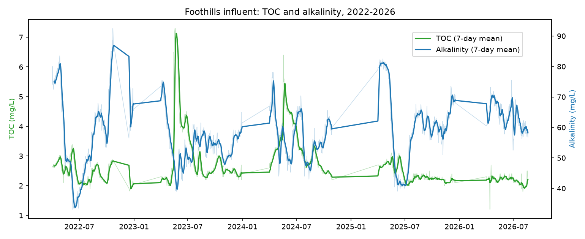
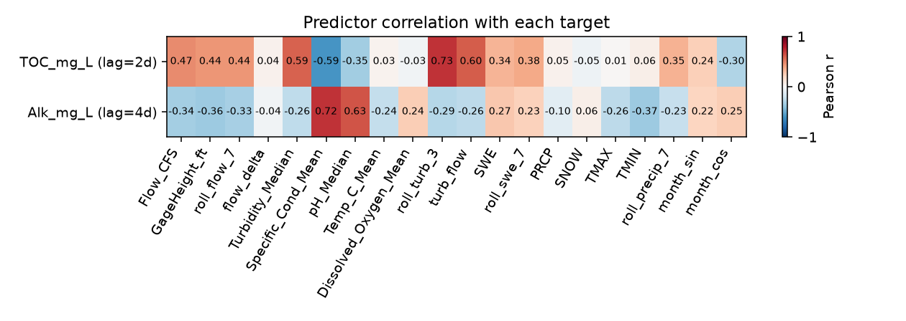
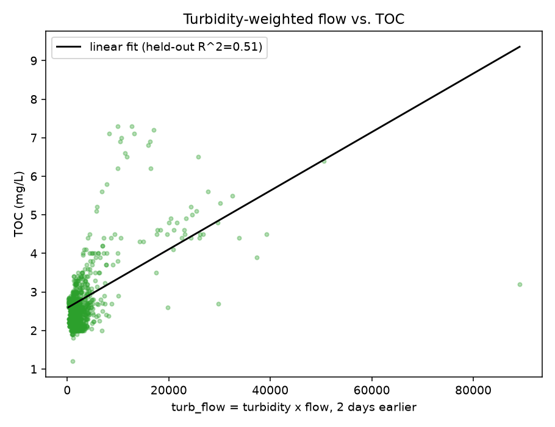
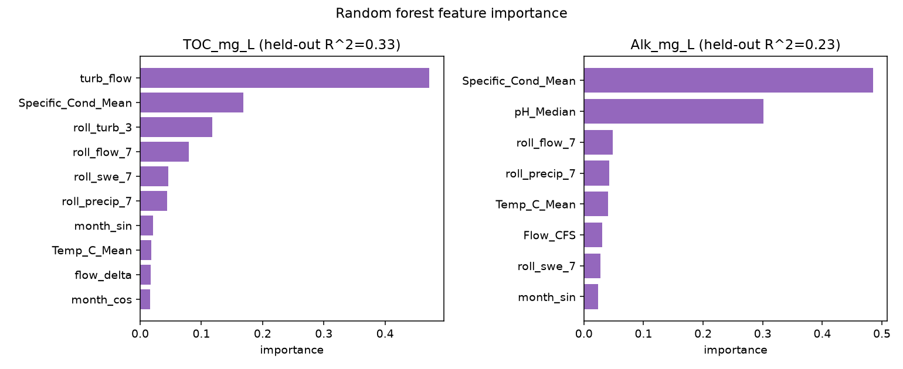
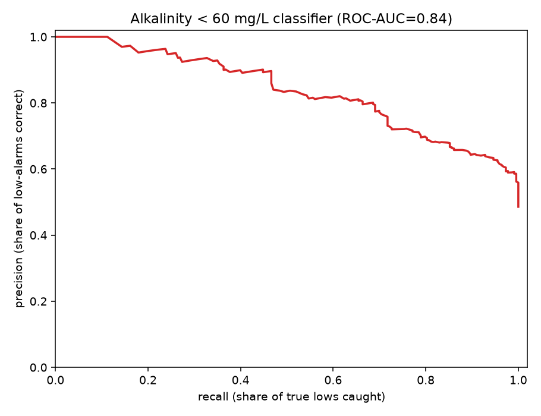
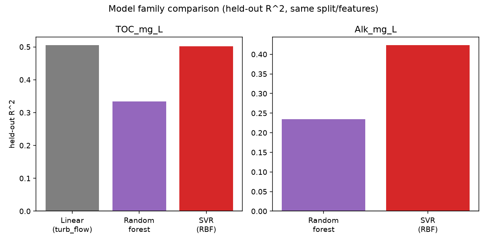
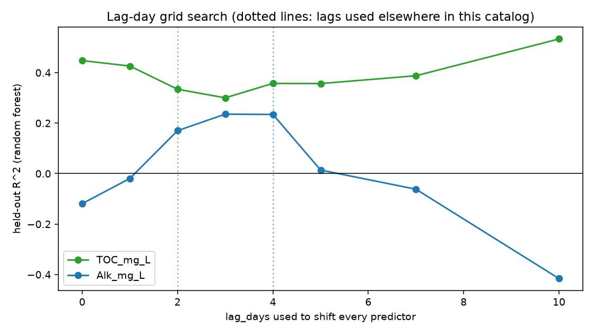
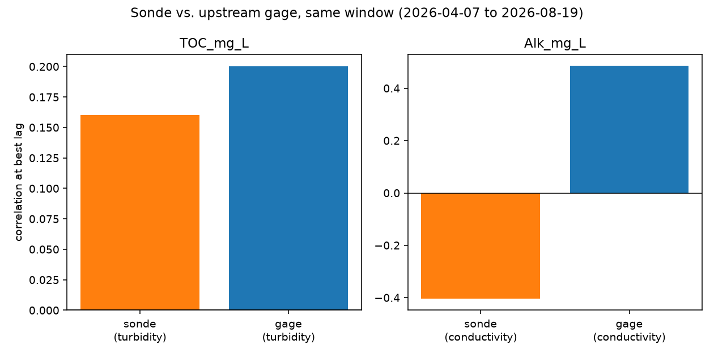

# Scenario 1: TOC and Alkalinity Predictive Model

Part of the [Design Storm 2026 challenge writeup](challenge_writeup.md) — see
that file for the shared intro, data terms, and reproduction steps. Quotes
below are transcribed directly from
[the deck](../../../reference/Explore%20DDD%202026%20Denver%20Water%20Design%20Storm%20Presentation.pdf)
(slide 9). Every number is computed by
[`analyze_parameters.py`](../analyze_parameters.py) and lives in
[`results/parameter_summary.md`](../results/parameter_summary.md) — see
[`parameters.md`](../parameters.md) for the full column-by-column catalog this
writeup draws on.

> Can watershed, hydrologic, and reservoir monitoring data provide enough
> advance warning to accurately predict TOC and alkalinity arriving at
> Foothills and give treatment staff actionable time to prepare?
>
> - Using national datasets upstream of Strontia Springs Reservoir; predict
>   TOC and Alkalinity concentrations a few days ahead hitting Foothills
>   treatment plant.
> - Introduce real-time Strontia profiling sonde data for improving
>   predictions. This location is much closer to the Foothills influent
>   which may influence accuracy but also impact lead/lag time.
> - Machine learning aficionados could try different models (like
>   support-vector machines), lag-times, and feature engineering to see if
>   they can improve performance.
> - Develop a web-application for viewing all the relevant data for
>   predictions (streamflow, weather, USGS sonde measured water quality),
>   and projected TOC and/or alkalinity.

## Available ML solutions (built here)

The first bullet is fully covered with the national datasets already in
`data/`: [`data_loader.py`](../data_loader.py) joins the USGS gage, DWR
telemetry, SNOTEL snowpack, and NOAA weather feeds onto the Foothills lab
results, shifted 2 days (TOC) / 4 days (alkalinity) as Jake's own models do.
[`models.py`](../models.py) fits a **RandomForestRegressor** per target on a
time-ordered (no shuffling, no leakage) split.

- **TOC_mg_L**: held-out R² = 0.334. A single-feature **linear regression**
  on just `turb_flow` (turbidity × flow, the strongest engineered term)
  already reaches R² = 0.505 on this split.
- **Alk_mg_L**: held-out R² = 0.234, led by `Specific_Cond_Mean` and
  `pH_Median`.









The deck's "yes/no" framing (guide.md's alkalinity-below-60 classifier) is
scored here with a full precision/recall curve instead of one operating
point — **ROC-AUC = 0.840** on the held-out split:



## Trying other model families and lag-times

The deck's third bullet asks ML enthusiasts to try other model families
(support-vector machines by name), different lag-times, and feature
engineering. Both are now implemented, same held-out split and feature
lists as the random forest results above, so the numbers are directly
comparable.

**Model family comparison** (`models.fit_svr_baseline`, an `SVR` with an RBF
kernel on standardized features — SVR is scale-sensitive, unlike the tree
models, so this pipeline scales first):



| target | model | held-out R² |
|---|---|---:|
| TOC_mg_L | Linear (turb_flow only) | 0.505 |
| TOC_mg_L | Random forest | 0.334 |
| TOC_mg_L | SVR (RBF kernel) | 0.502 |
| Alk_mg_L | Random forest | 0.234 |
| Alk_mg_L | SVR (RBF kernel) | 0.423 |

The deck's hunch was right on this split: **SVR beats the random forest for
both targets**, and very nearly matches the single-feature linear model for
TOC. That last part is worth sitting with rather than skimming past — a
10-feature SVR landing within 0.003 R² of a 1-feature straight line through
`turb_flow` says the extra nine features are adding almost nothing here, for
either model family. Whether that's a ceiling in what this data can support,
or a split/hyperparameter artifact (`C=10, epsilon=0.1` were not tuned), is
an open question this catalog didn't chase further — a `GridSearchCV` over
SVR's `C`/`epsilon`/`gamma` is a natural next step and, like the deck says,
"a small, well-isolated extension of the same module."

**Lag-day grid search** (`build_dataset` rebuilt at each candidate lag, same
random forest refit each time):



| lag (days) | TOC_mg_L R² | Alk_mg_L R² |
|---:|---:|---:|
| 0 | 0.448 | -0.119 |
| 1 | 0.426 | -0.019 |
| 2 | 0.334 | 0.170 |
| 3 | 0.300 | 0.236 |
| 4 | 0.358 | 0.234 |
| 5 | 0.357 | 0.014 |
| 7 | 0.388 | -0.062 |
| 10 | 0.534 | -0.416 |

Read this one carefully rather than picking the highest number in the
column: alkalinity's R² craters to -0.416 at lag=10 and is negative at
lag=0-1 too, swinging over a 0.65-point range across the grid. `guide.md`
section 10 already warned that a single 50/50 split's R² "is not a stable
property of the model" (its own cross-validated TOC forest scored a mean R²
of -0.66 across time slices) — this grid is the same instability showing up
along a different axis (lag choice instead of test-slice choice), not new
evidence that lag=10 is secretly better than lag=4. The one genuinely
useful read: alkalinity's R² is consistently positive and closely clustered
(0.17-0.24) only across lag=2-4, which is a real, if narrow, basis for
Jake's choice of 4. TOC's curve never dips negative anywhere in the grid,
which is a mildly reassuring sign that the turbidity/flow signal it depends
on is more robust to the exact lag than alkalinity's conductance signal is.

## A web viewer for "projected TOC and/or alkalinity"

The deck's fourth bullet asks for a web application to view predictions
alongside the data behind them (streamflow, weather, USGS water quality).
[`viewer.html`](../viewer.html) is a small, hand-maintained static page (no
build step, matching `design-storm-water-system-3d.html`'s own convention)
that fetches [`results/predictions.json`](../results/predictions.json) —
exported by `analyze_parameters.export_viewer_json` — and plots, with
Chart.js:

- **TOC and alkalinity, actual vs. predicted**, the full timeline, with the
  held-out test predictions drawn in a different color from the in-sample
  training predictions so a viewer can't mistake training fit for
  generalization.
- **Upstream context**: streamflow, turbidity, precipitation, and snowpack,
  each on their own true (unlagged) dates.

Serve it like the 3D map (it fetches JSON, so opening the file directly
won't work):

```
python3 serve.py            # from the repository root
# open http://localhost:8765/teams/shallow-learning-parameters/viewer
```

## The Strontia sonde as a closer predictor

Update: the Strontia profiling sonde file (`Strontia 0407_0819.xlsx`) was
absent from this workspace when this catalog first checked, but is now
present in `data/` — [`sonde_loader.py`](../sonde_loader.py) loads it. This
section corrects that earlier gap note rather than silently dropping it: an
absence that was reported twice as "confirmed" is worth being explicit
about once it changes.

The sonde only covers 2026-04-07 to 2026-08-19 (one season, 390 casts,
135 overlapping lab results) — far short of the upstream gage's 2022-2026
record — so `analyze_parameters._sonde_predictor_table` scores both sensors
on that *same* restricted window, not the gage's full history, for a fair
comparison:



| sensor | predictor | target | best lag (days) | correlation at best lag |
|---|---|---|---:|---:|
| sonde (Strontia) | Turbidity_NTU | TOC_mg_L | 10 | 0.160 |
| USGS gage (upstream) | Turbidity_Median | TOC_mg_L | 4 | 0.200 |
| sonde (Strontia) | Conductivity | Alk_mg_L | 7 | -0.404 |
| USGS gage (upstream) | Specific_Cond_Mean | Alk_mg_L | 4 | 0.486 |

The deck's hypothesis — that the closer sensor might improve accuracy but
shorten lead time — is only half right here, and the half that's wrong is
the more interesting result. Lead time did *not* clearly shorten: the
sonde's best-fit lag is 10 days for turbidity and 7 for conductivity, both
*longer* than the gage's 4-day lag on the same window, not shorter. And
accuracy did not improve: on this restricted window, both sensors are much
weaker predictors than the multi-year numbers in the section above suggest
(gage turbidity drops from r=0.709 over the full record to r=0.200 on just
this one season) — most of that full-record correlation comes from
year-to-year variation (wet years like 2024 vs. dry years like 2026), not
day-to-day variation within one season, and a single season can't recover
it. The sonde's conductivity result is the one that needs a caveat of its
own: it correlates *negatively* with alkalinity (r=−0.404) where the gage's
conductance correlates strongly positively (r=0.486) — opposite signs on
the same physical quantity, on overlapping dates. That's either a real
effect (the sonde sits in the reservoir past whatever alkalinity-relevant
mixing happens between the river and Foothills, so "closer" isn't
necessarily "more representative") or a data-handling issue in how this
catalog aggregated the near-surface reading; it isn't resolved here and
shouldn't be trusted without more digging.

## What the deck asks for that isn't here

Nothing, as it turns out — every bullet in this scenario now has at least
an attempted implementation above. The Strontia sonde result is a genuine
answer, just not the one the deck's hypothesis expected.
