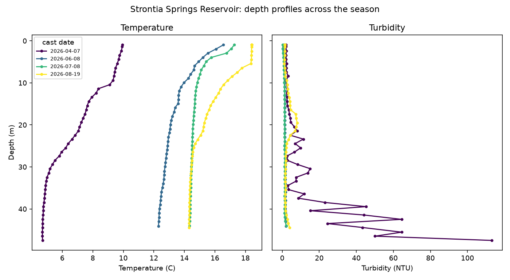
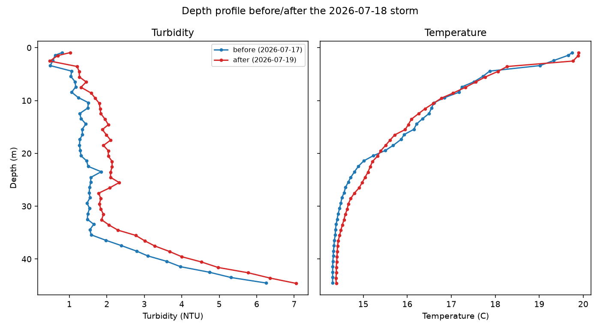

# Scenario 2: Storm and Runoff Events and Real-Time Data Application

Part of the [Design Storm 2026 challenge writeup](challenge_writeup.md) — see
that file for the shared intro, data terms, and reproduction steps. Quote
below is transcribed directly from
[the deck](../../../reference/Explore%20DDD%202026%20Denver%20Water%20Design%20Storm%20Presentation.pdf)
(slide 10). Every number is computed by
[`analyze_parameters.py`](../analyze_parameters.py) and lives in
[`results/parameter_summary.md`](../results/parameter_summary.md).

> Given current watershed and reservoir conditions, how is an incoming storm
> or runoff event likely to affect source-water quality, when will that
> impact arrive, and what conditions might we expect at different depths
> within Strontia Springs Reservoir?
>
> - Model precipitation events' impact on real time water quality parameters
>   above Strontia Springs reservoir.
> - Further adapt that model to evaluate Strontia Springs Reservoir Sonde
>   data, how do water quality parameters change and distribute by depth in
>   the reservoir and how is that impacted by storms and spring runoff.
> - Look at historical datasets and model how major precipitation events
>   have impacted water quality in the system.

## Available ML solutions (built here)

Update: the Strontia sonde file (`Strontia 0407_0819.xlsx`) was absent from
this workspace when this catalog first checked this scenario, but is now
present in `data/` — [`sonde_loader.py`](../sonde_loader.py) loads it, so
the two depth-profile bullets below are now answerable, not just the third.

**How water quality varies by depth, across the season** (deck bullet 2).
[`sonde_loader.cast_summary`](../sonde_loader.py) turns the sonde's raw
readings into one row per profiling cast (roughly every 6 hours,
2026-04-07 to 2026-08-19); a handful of those casts, spread across the
season, show the reservoir's thermal structure changing from a nearly
uniform ~5-10°C column in April to a sharply layered warm-surface /
cold-bottom column by June-August (a textbook thermocline):

The April profile's turbidity panel is worth a second look: it spikes to
over 100 NTU near the bottom (45m) while staying under 5 NTU near the
surface, the whole season's most extreme turbidity reading of any depth —
consistent with cold, sediment-laden spring inflow plunging beneath the
water column rather than mixing at the surface, though this catalog didn't
chase that specific mechanism further.

**Whether storms redistribute water quality through the column** (deck
bullet 2, continued). The real 2026-07-18 storm (peak flow and turbidity
within the sonde's window) has full-depth casts on both sides of it:

Turbidity rises at *every* depth after the storm (roughly +0.2 to +1 NTU
from surface to bottom, most pronounced in the 10-30m range) — the storm's
signal does reach the whole water column, not just the surface. The
temperature profile shifts too: mid-depth water (15-30m) reads slightly
colder after the storm than before, while the surface and bottom stay
about the same, a small but real redistribution.

**Lake turnover / stratification over the season** is covered in
[Scenario 3](scenario3_snowpack_system.md), which is where the deck's third
bullet in that scenario asks for it directly.

That leaves the first bullet, historical precipitation vs. water quality,
which the national daily datasets support directly:

- **Precipitation's correlation with the targets is weak on its own**:
  `PRCP` correlates only 0.046 with TOC_mg_L and -0.104 with Alk_mg_L
  (see `parameter_summary.md`). This matches `guide.md`'s own note that
  the DWR gage's raw `Precip` column is unreliable — but even NOAA's
  cleaner `PRCP` reading, alone, is a poor predictor.
- **Flow and turbidity, which precipitation drives indirectly, are the real
  signal**: `roll_turb_3` (0.725) and `Flow_CFS` (0.473) correlate far more
  strongly with TOC than rainfall does directly. The practical model for
  "how will an incoming storm affect water quality" is therefore not
  "precipitation → TOC" but "precipitation → runoff/turbidity → TOC",
  exactly the physical chain `guide.md` section 3 describes.
- **Unsupervised regime discovery**: with no target at all, standardizing
  every engineered predictor and clustering with **KMeans (k=3)** plus a
  **PCA** projection to 2D separates a distinct 36-day cluster with mean
  flow 844 CFS and mean TOC 5.44 mg/L from the other ~800 days
  (579/322 CFS, 2.53/2.55 mg/L) — i.e., storm/runoff days are
  identifiable from upstream sensor data alone, without ever being told
  which days had a storm.

## What the deck asks for that isn't here

- A model trained on labeled storm *events* specifically (the regime
  clustering above groups days by feature similarity, not by matching them
  to a precipitation-event calendar, and the sonde depth comparison above
  uses one hand-picked storm rather than every storm in its window) — a
  reasonable next step once event dates are defined for either dataset.
