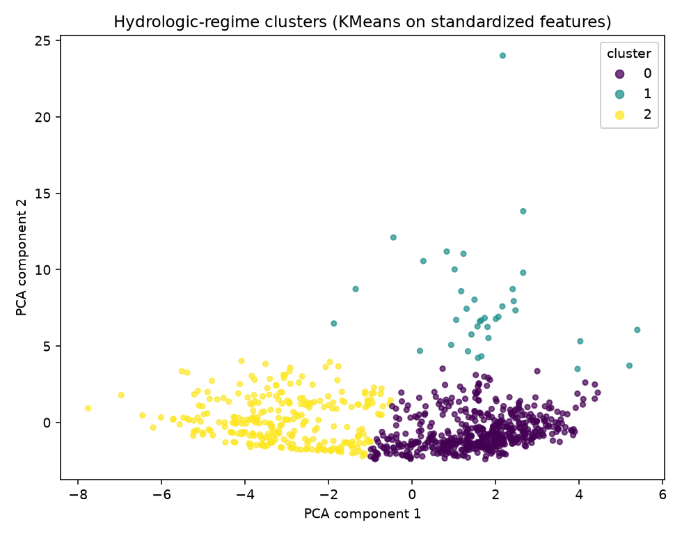

# Scenario 2: Storm and Runoff Events and Real-Time Data Application

Part of the [Design Storm 2026 challenge writeup](challenge_writeup.md) — see
that file for the shared intro, data terms, and reproduction steps. Quote
below is transcribed directly from
[the deck](../../../reference/Explore%20DDD%202026%20Denver%20Water%20Design%20Storm%20Presentation.pdf)
(slide 10). Every number is computed by
[`analyze_parameters.py`](../analyze_parameters.py) and lives in
[`results/parameter_summary.md`](../results/parameter_summary.md).

> Given current watershed and reservoir conditions, how is an incoming storm
> or runoff event likely to affect source-water quality, when will that
> impact arrive, and what conditions might we expect at different depths
> within Strontia Springs Reservoir?
>
> - Model precipitation events' impact on real time water quality parameters
>   above Strontia Springs reservoir.
> - Further adapt that model to evaluate Strontia Springs Reservoir Sonde
>   data, how do water quality parameters change and distribute by depth in
>   the reservoir and how is that impacted by storms and spring runoff.
> - Look at historical datasets and model how major precipitation events
>   have impacted water quality in the system.

## Available ML solutions (built here)

The two depth-profile bullets need the Strontia sonde file, which — as in
[Scenario 1](scenario1_toc_alkalinity.md) — isn't in this workspace's
`data/`; nothing here models reservoir stratification by depth. That leaves
the third bullet, historical precipitation vs. water quality, which the
national datasets do support:

- **Precipitation's correlation with the targets is weak on its own**:
  `PRCP` correlates only 0.046 with TOC_mg_L and -0.104 with Alk_mg_L
  (see `parameter_summary.md`). This matches `guide.md`'s own note that
  the DWR gage's raw `Precip` column is unreliable — but even NOAA's
  cleaner `PRCP` reading, alone, is a poor predictor.
- **Flow and turbidity, which precipitation drives indirectly, are the real
  signal**: `roll_turb_3` (0.725) and `Flow_CFS` (0.473) correlate far more
  strongly with TOC than rainfall does directly. The practical model for
  "how will an incoming storm affect water quality" is therefore not
  "precipitation → TOC" but "precipitation → runoff/turbidity → TOC",
  exactly the physical chain `guide.md` section 3 describes.
- **Unsupervised regime discovery**: with no target at all, standardizing
  every engineered predictor and clustering with **KMeans (k=3)** plus a
  **PCA** projection to 2D separates a distinct 36-day cluster with mean
  flow 844 CFS and mean TOC 5.44 mg/L from the other ~800 days
  (579/322 CFS, 2.53/2.55 mg/L) — i.e., storm/runoff days are
  identifiable from upstream sensor data alone, without ever being told
  which days had a storm.

## What the deck asks for that isn't here

- Depth-resolved reservoir modeling (needs the sonde file — see
  [Scenario 1](scenario1_toc_alkalinity.md)).
- A model trained on labeled storm *events* specifically (this analysis
  clusters days by feature similarity, not by matching them to a
  precipitation-event calendar) — a reasonable next step once event dates
  are defined.
