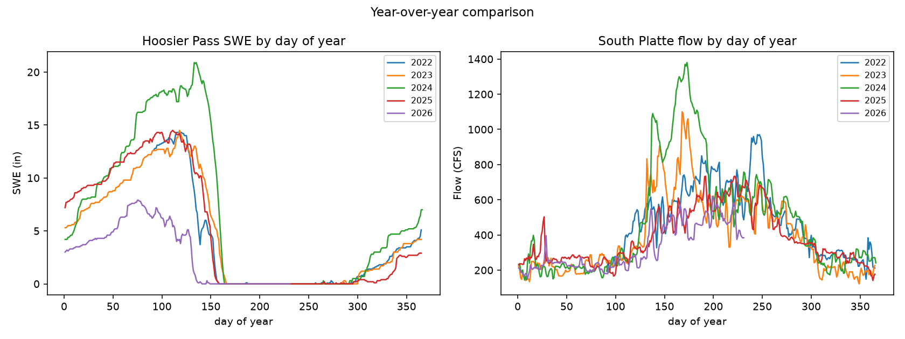
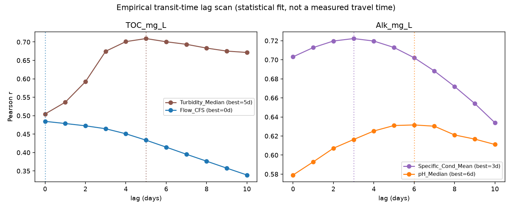
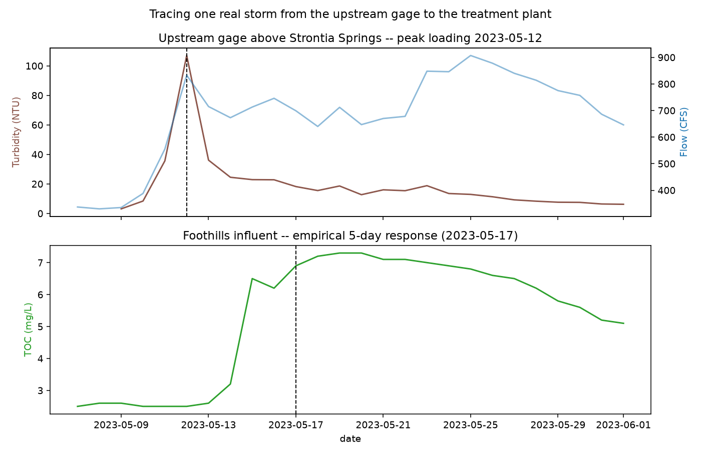
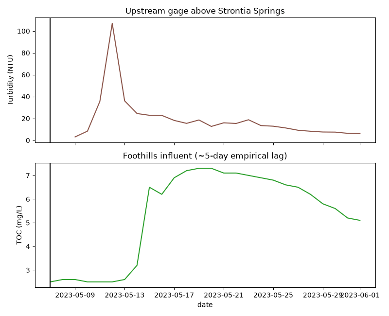

# Scenario 3: Snowpack and Surface Water System Function

Part of the [Design Storm 2026 challenge writeup](challenge_writeup.md) — see
that file for the shared intro, data terms, and reproduction steps. Quote
below is transcribed directly from
[the deck](../../../reference/Explore%20DDD%202026%20Denver%20Water%20Design%20Storm%20Presentation.pdf)
(slide 11). Every number is computed by
[`analyze_parameters.py`](../analyze_parameters.py) and lives in
[`results/parameter_summary.md`](../results/parameter_summary.md).

> Develop an interactive model that visualizes how water and water-quality
> conditions move from the watershed through the collection system to the
> treatment plants and evaluate how hydrologic and seasonal events influence
> that movement.
>
> - Develop a model or visualization of datasets that demonstrate how water
>   enters and moves through the system to our treatment plants.
> - Focus on different aspects of the water system (ex) Historical snowpack
>   and streamflow, and how those change from year to year (drought vs wet
>   years).
> - Choose a parameter or parameters to visualize and follow through the
>   system, see if different factors have an impact on transport (snowpack,
>   rainstorms, lake turnover).

## Available ML solutions (built here)

The first bullet — an interactive model of the whole system — already
exists: [`design-storm-water-system-3d.html`](../../../design-storm-water-system-3d.html)
(serve with `python3 serve.py` from the repo root) is Denver Water's own
worked example for this scenario. This catalog adds the second bullet, which
that map doesn't cover: a **year-over-year comparison** of Hoosier Pass SWE
and South Platte flow, both re-indexed to day-of-year so different years
overlay directly.

Computed per year (`parameter_summary.md`):

| year | mean SWE (in) | peak SWE (in) | mean flow (CFS) | peak flow (CFS) | mean TOC (mg/L) |
|---:|---:|---:|---:|---:|---:|
| 2022 | 3.03 | 14.3 | 497.6 | 970 | 2.44 |
| 2023 | 4.70 | 14.5 | 395.3 | 1100 | 2.97 |
| 2024 | 6.64 | 20.9 | 476.5 | 1380 | 3.26 |
| 2025 | 4.87 | 14.5 | 386.3 | 734 | 2.37 |
| 2026 | 3.00 | 7.9 | 328.7 | 620 | 2.18 |

2024 is the clear wet year here (highest mean and peak SWE, highest peak
flow, highest mean TOC — more snowmelt volume tracks with more organic
carbon reaching the plant, consistent with Scenario 1's findings). 2026's
peak SWE of 7.9 in is roughly a third of 2024's 20.9 in, and its mean flow
is the lowest of the five years — a direct, data-grounded read of the
"2026 drought" the deck itself names as a sector challenge (slide 5).

## Transit-time tracing: "follow a parameter through the system"

The third bullet asks to choose a parameter and follow it through the
system, checking whether snowpack, rainstorms, or lake turnover change how
it travels. Lake turnover is out of reach (see the gap note below), but
snowpack/rainstorm transport is answerable with what's here, in three steps
that build on each other.

**1. How long does a signal actually take to show up?** Rather than assume
Jake's fixed 2-day (TOC) / 4-day (alkalinity) lag, `models.lag_correlation_scan`
correlates each raw upstream predictor against each target at every lag from
0 to 10 days and reports where the correlation peaks — an empirical,
per-predictor transit/mixing time.

| predictor | target | best lag (days) | correlation at best lag |
|---|---|---:|---:|
| Turbidity_Median | TOC_mg_L | 5 | 0.709 |
| Flow_CFS | TOC_mg_L | 0 | 0.485 |
| Specific_Cond_Mean | Alk_mg_L | 3 | 0.722 |
| pH_Median | Alk_mg_L | 6 | 0.632 |

Two things worth reading carefully here, not just the peak numbers. First,
**flow's best lag is 0 days** — the river's own volume responds the same day
water arrives, which is exactly what you'd expect physically (it doesn't
need to mix with anything to register as "more water"). **Turbidity peaks
5 days out**, later than flow, because suspended sediment has to actually
travel and redistribute through Strontia Springs Reservoir before it shows
up in a lab sample at Foothills — the mixing-time story `guide.md` section 1
describes, not raw travel time. Second, conductance's curve
(right panel) is fairly flat across 2-5 days (0.70-0.72 the whole span) —
alkalinity's signal is *broad* in time, not a sharp single-day peak, which
is a weaker, less confident basis for picking one lag than TOC's more
sharply peaked curve. Both curves are read directly from `parameter_summary.md`
("Empirical transit-time lag scan"); nothing here is asserted from the shape
of the plot without the underlying number to back it.

**2. What does that look like for one real storm?** Numbers on a page don't
show *why* a 5-day lag makes sense the way watching a real event does. The
single highest turbidity x flow "loading" day in the whole dataset —
**2023-05-12** — is used here as a concrete trace: the upstream gage's
turbidity and flow both spike that day, and the Foothills lab result is
plotted on its own axis below, with the empirically-fit response date
marked.

Reading it left to right: turbidity and flow rise together and peak
sharply on 2023-05-12. TOC at the plant is still flat for a few more days,
then climbs steeply starting 2023-05-15 and peaks around 2023-05-19-20 —
roughly a week after the upstream spike, bracketing the 5-day empirical lag
marked on the plot. The plant's TOC then decays much more slowly than the
upstream turbidity spike did (compare the sharp brown peak above to the
gentle green decline below) — consistent with a reservoir smoothing out a
sharp pulse rather than passing it straight through, again the "mixing" idea
rather than a plug of water arriving and leaving on schedule.

**3. Watching it happen.** The closest thing here to the deck's "single
unified... animation" of a parameter moving through the system: the same
storm window, animated as a synchronized cursor sweeping day by day across
the upstream gage (top) and the Foothills lab result (bottom).

This is deliberately *not* an animation of a literal water parcel travelling
from point A to point B — this data cannot ground that claim (see the
caveat below). What it does show honestly: watch the cursor cross the
upstream peak, then keep watching as it takes several more sweeps before
the bottom panel's curve turns upward — the lag is visible as elapsed time
between the two panels reacting, not asserted as a physical transit path.

**A caveat that matters more than any of the numbers above:** Denver
Water's own hydraulic model puts the physical water travel time from this
sensor to the plant intake at about **four hours** (`guide.md` section 1).
The multi-day lags found here are empirical best-fit correlations, not
transit times — Jake's own materials attribute the gap to mixing and
deposition inside Strontia Springs Reservoir, and he explicitly asks that
the exact lag number not be leaned on because it keeps moving as more data
arrives. Treat "5 days" as "this is how long it takes the reservoir to
finish responding to a pulse," not "this is how long the water was in
transit."

## What the deck asks for that isn't here

- **"Lake turnover"** (third bullet) needs the same Strontia sonde
  depth-profile data as [Scenario 2](scenario2_storm_runoff.md) — confirmed
  twice now, still not present in this workspace's `data/`. Nothing above
  touches depth or stratification; the transit-time tracing above is
  entirely from the single upstream gage and the Foothills lab result, both
  surface/single-point measurements.
- A model that identifies *storm events* automatically and traces all of
  them this way, rather than the one hand-picked highest-loading day above —
  `05_hydrologic_regimes.png`'s cluster view is a step toward automatic
  event detection (it already separates a 36-day high-flow/high-TOC cluster
  from the rest), but nothing here yet turns that cluster into a list of
  discrete, dated events to animate one after another.
